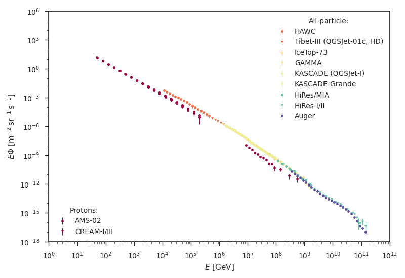

Cosmic-ray energy spectra
=========================

This Python package provides a database of published cosmic-ray energy spectra,
measured by surface detectors like *IceTop* or the *Pierre Auger Observatory*.
Moreover, it gives access to an `external database`_, which includes electrons,
positrons, anti-protons, and nuclide up to ``Z = 30`` for energies below the
cosmic-ray *knee*.

Getting started
---------------

A measured cosmic-ray energy spectrum can be requested via:

::

   >>> import crspectra
   >>> database = crspectra.CRSpectra()
   >>> spectrum = database.request("GAMMA")

A structured *NumPy* array is returned containing the requested cosmic-ray
data. The fields are ``energy``, ``flux``, statistical ``stat`` and
systematical ``sys`` uncertainty on the flux, and uncertainty is upper a limit
``uplim``. The energy is given in ``GeV`` and the flux is given in ``GeV^-1
m^-2 s^-1 sr^-1``. The uncertainties describe the lower and upper uncertainty
relative to the flux.

The list of available experiments is obtained via:

::

   >>> experiments = database.experiments

Data from the `external database`_ can be requested via:

::

   >>> spectrum = database.from_external("AMS-02")

The following plot was created using this package; see the `example`_ *Jupyter*
notebook:

   Cosmic-ray proton and all-particle energy spectra. Only statistical
   uncertainties are shown.

References
----------

Please cite the following papers when using this database:

   CREAM-I/III
      Y. S. Yoon et al., The Astrophysical Journal 839.1 (2017), p. 5
   HAWC
      R. Alfaro et al., Physical Review D96.12 (2017), p. 12201

.. Links
.. _external database:
   http://lpsc.in2p3.fr/crdb/
.. _example:
   ./example/crspectra.ipynb
